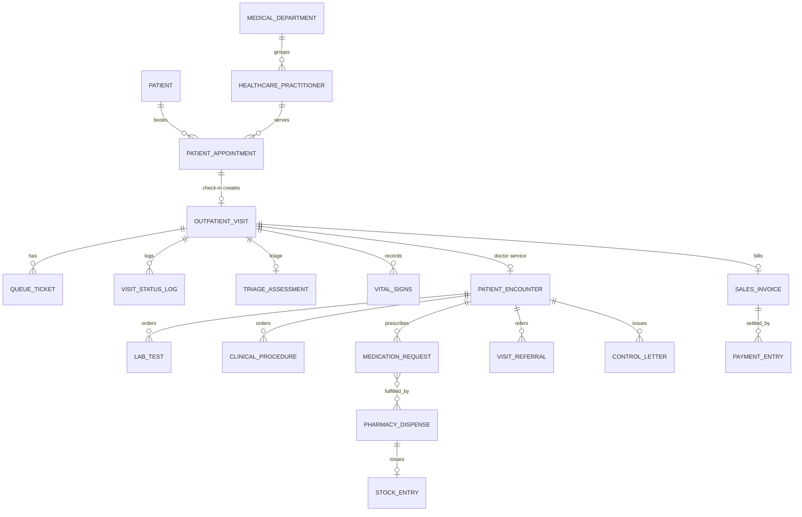

# Data Model & Technical Design — SIMRS Mini (Frappe Healthcare v15)

> **Versi:** 0.1 (draft) · **Tanggal:** 2026-10-04
> Pelengkap `prd.md` dan `system-hierarchy.md`. Menjelaskan DocType (native vs custom), field, state machine, hook, API, dan realtime.
>
> ⚠️ Nama DocType/field **native** Healthcare di sini adalah asumsi kerja. Daftar yang harus diverifikasi ada di §12 (checklist Discovery). **Aturan:** *pakai native bila ada; bangun custom hanya untuk celah yang terbukti.*

---

## 1. Prinsip & konvensi

| # | Prinsip |
|---|---|
| P-1 | **Jangan memodifikasi core** `frappe`, `erpnext`, `healthcare`. Semua perubahan lewat app `simrs_mini`: Custom Field, Property Setter, `doc_events`, `override_whitelisted_methods`, fixtures, patches. |
| P-2 | Custom DocType diprefix konsep bisnis yang jelas, module = `SIMRS Mini`. Custom Field diberi `insert_after` + nama field snake_case. |
| P-3 | Aksi bisnis (check-in, panggil, finalize) = **fungsi service + method whitelist** dengan guard role. UI hanya memanggilnya. |
| P-4 | Perubahan status lewat **satu fungsi transisi** (`visit_state.transition`) — tidak ada `doc.db_set("status", …)` tersebar. |
| P-5 | **Idempoten:** check-in, pembuatan tiket, dan agregasi billing aman dipanggil ulang. |
| P-6 | Tidak ada `delete` data klinis/keuangan; koreksi = cancel/amend/return + alasan. |
| P-7 | Zona waktu `Asia/Jakarta`, mata uang `IDR`, bahasa UI `id`; nama DocType/field tetap Inggris, **label** Indonesia. |
| P-8 | Tidak ada PHI di log aplikasi/exception message. |
| P-9 | **Satu site, satu app (`simrs_mini`), satu Desk, satu database.** Tampilan per user dibedakan oleh **Workspace per role** — bukan aplikasi atau DB terpisah (lihat `system-hierarchy.md` §0). |
| P-10 | Satu-satunya klien eksternal MVP adalah **Kanal Appointment**, yang hanya memakai **Appointment API** (akun layanan). Tidak ada tabel milik kanal; *source of truth* = `Patient Appointment`. |
| P-11 | Menu tersembunyi bukan kontrol akses: setiap endpoint/DocType tetap menegakkan izin di server. |

---

## 2. Peta entitas

| Objek bisnis | DocType | Asal | Fase | Menu |
|---|---|---|---|---|
| Pasien | `Patient` | Native + custom field | P1 | 1.2, 1.5 |
| Dokter | `Healthcare Practitioner` (+ schedule) | Native | P1 | 1.1 |
| Poli | `Medical Department` | Native | P1 | 1.1 |
| Ruang / service unit | `Healthcare Service Unit` | Native | P1 | 8.1 |
| Booking / registrasi | `Patient Appointment` | Native + custom field | P1 | 1.1, 1.2, 1.4 |
| **Alur kunjungan** | **`Outpatient Visit`** | **Custom** | P1 | 1.4, 7.6 |
| **Antrian** | **`Queue Ticket`**, `Queue Counter` | **Custom** | P1 | 1.7, 8.x |
| TTV | `Vital Signs` | Native | P1 | 2.3 |
| **Skrining triase** | **`Triage Assessment`** | **Custom** | P1 | 2.4 |
| Encounter / SOAP / diagnosis | `Patient Encounter` | Native + custom field | P1 | 3.4–3.12 |
| Order lab & hasil | `Lab Test`, `Sample Collection` (atau `Service Request`) | Native | P1 | 4.1, 4.5 |
| Tindakan | `Clinical Procedure` | Native | P1 | 3.8 |
| Resep | `Medication Request` (via Encounter) | Native | P1 | 3.9 |
| **Dispensing** | **`Pharmacy Dispense`** | **Custom** + ERPNext Stock | P1 | 5.x |
| Tarif | `Item`, `Item Price`, `Price List` | ERPNext | P1 | 6.3 |
| Billing | `Sales Invoice` | ERPNext + custom field | P1 | 6.1 |
| Pembayaran | `Payment Entry`, `Mode of Payment` | ERPNext | P1 | 6.5 |
| Rujukan | **`Visit Referral`** | Custom | P2 | 3.8, 7.4 |
| Surat kontrol | **`Control Letter`** | Custom | P2 | 7.3 |
| Koreksi pasca-final | **`Amendment Request`** | Custom | P2 | X2 |
| Break-glass & akses chart | **`Break Glass Log`**, **`Patient Chart Access Log`** | Custom | P2 | X2b |
| Konfigurasi | **`SIMRS Mini Settings`** (Single) | Custom | P1 | — |
| Tampilan per role | `Workspace` + Page (`registration-desk`, `triage-station`, `doctor-workspace`, `pharmacy-station`, `cashier-station`) | Config/Custom | P1 | semua |
| Kanal booking pasien | **Appointment API** (whitelisted, akun `Appointment Channel Service`) | Custom | P1 (dipakai staf) / P2 (kanal) | 1.1 |

---

## 3. DocType custom

Modul: `SIMRS Mini`. Tipe field memakai istilah Frappe.

### 3.1 `Outpatient Visit` — orkestrator alur kunjungan

Satu dokumen per kunjungan, dibuat saat **check-in**. Menyimpan *di mana pasien sekarang* dan menautkan semua dokumen kunjungan.

| Field | Tipe | Keterangan |
|---|---|---|
| `naming_series` | Select | `OPV-.YYYY.-.#####` |
| `patient` | Link `Patient` (reqd) | |
| `patient_name` | Data (fetch) | |
| `appointment` | Link `Patient Appointment` (reqd, **unique**) | 1 Visit : 1 Appointment |
| `encounter` | Link `Patient Encounter` | Terisi saat "Mulai Pelayanan" |
| `medical_department` | Link `Medical Department` | fetch dari Appointment |
| `practitioner` | Link `Healthcare Practitioner` | |
| `service_unit` | Link `Healthcare Service Unit` | ruang |
| `registration_source` | Select | Appointment / Walk-in / Kiosk |
| `payer_type` | Select | Umum / Asuransi / BPJS |
| `eligibility_status` | Select | Belum Diverifikasi / Valid / Tidak Valid / Tidak Perlu |
| `visit_status` | Select (read-only) | lihat §6.1 |
| `pharmacy_status` | Select (read-only) | Not Required / Pending / Preparing / Ready / Dispensed |
| `billing_status` | Select (read-only) | Pending / Invoiced / Paid / Guaranteed |
| `has_prescription` | Check | |
| `pending_orders` | Int | jumlah order penunjang belum selesai |
| `follow_up_decided` | Check | wajib sebelum CLOSED |
| `sales_invoice` | Link `Sales Invoice` | |
| `checked_in_at`, `triage_started_at`, `triage_completed_at`, `service_started_at`, `service_completed_at`, `closed_at` | Datetime | untuk metrik waktu tunggu |
| `escalated_to` | Data | bila ESCALATED |
| `cancel_reason` | Small Text | bila CANCELLED |
| `status_log` | Table → `Visit Status Log` | read-only |

**`Visit Status Log`** (child): `from_state`, `to_state`, `changed_at`, `changed_by`, `reason` (wajib untuk override).

Permission: lihat `user-role.md` §6. Write hanya via service.

### 3.2 `Queue Ticket`

| Field | Tipe | Keterangan |
|---|---|---|
| `queue_type` | Select (reqd) | Registrasi / Triase / Dokter / Farmasi / Kasir |
| `queue_date` | Date | default hari ini |
| `prefix` | Data | mis. `A` (poli), `T`, `F`, `K` |
| `sequence` | Int | urutan harian per (type, prefix) |
| `ticket_no` | Data | `A-023` (prefix + sequence 3 digit) |
| `outpatient_visit` | Link | |
| `patient` | Link | tidak ditampilkan di display |
| `medical_department` / `practitioner` / `service_unit` | Link | tujuan & ruang |
| `status` | Select | WAITING / CALLED / IN_SERVICE / SKIPPED / COMPLETED / CANCELLED |
| `priority` | Select | Normal / Prioritas |
| `call_count` | Int | recall menambah; status tetap CALLED |
| `created_at`, `called_at`, `started_at`, `completed_at` | Datetime | |
| `called_by` | Link `User` | |
| `skip_reason` | Small Text | |

Unique index: `(queue_date, queue_type, prefix, sequence)`.

**`Queue Counter`**: `queue_date`, `queue_type`, `prefix`, `last_sequence`. Dibaca dengan `for_update=True` agar nomor tidak ganda saat dua loket menerbitkan bersamaan.

### 3.3 `Triage Assessment`

| Field | Tipe |
|---|---|
| `outpatient_visit`, `patient`, `vital_signs` | Link |
| `chief_complaint` | Small Text |
| `fall_risk` | Select (Rendah / Sedang / Tinggi) |
| `reported_allergies` | Small Text |
| `pain_score` | Int (0–10) |
| `infection_screening` | Select (Tidak ada / Perlu evaluasi / Perlu isolasi) |
| `special_condition` | Small Text |
| `outcome` | Select (Normal / Perlu Perhatian / Perlu Eskalasi) |
| `escalated_to` | Data |
| `nursing_notes` | Text |
| `triaged_by` (User), `triaged_at` (Datetime) | |

Catatan desain: nilai TTV di luar rentang hanya memunculkan **peringatan**, tidak mengisi diagnosis otomatis.

### 3.4 `Pharmacy Dispense` (submittable)

| Field | Tipe | Keterangan |
|---|---|---|
| `outpatient_visit`, `patient`, `encounter` | Link | |
| `stage` | Select | Pending Verification / Verified / Preparing / Ready (docstatus 0) |
| `items` | Table → `Pharmacy Dispense Item` | `medication_request`, `item_code`, `qty`, `uom`, `dosage_instruction`, `batch_no`, `warehouse` |
| `clarification_requested` (Check), `clarification_note` | | memicu notifikasi ke dokter |
| `verified_by`, `verified_at`, `dispensed_by`, `dispensed_at` | | |
| `stock_entry` | Link `Stock Entry` | dibuat saat submit |

Submit = **DISPENSED** (stok keluar). Cancel hanya dengan alasan.

### 3.5 `SIMRS Mini Settings` (Single)

`prefix_map` (tabel: queue_type/department → prefix), `queue_display_refresh_seconds` (default 3), `max_recall_before_skip` (default 3), `require_triage` (Check), `default_price_list_umum/asuransi/bpjs`, `pharmacy_warehouse`, `auto_close_visit` (Check).

### 3.6 DocType P2 (ringkas)

| DocType | Field inti |
|---|---|
| `Visit Referral` | `referral_type` (Internal/External), `from_encounter`, `to_department`, `to_practitioner`, `destination_facility`, `reason`, `status` (Requested/Accepted/Scheduled/Completed/Cancelled), `resulting_appointment` — **referral = intent, bukan encounter baru** |
| `Control Letter` | `encounter`, `patient`, `practitioner`, `control_date`, `reason`, `instructions`, `printed_at` |
| `Amendment Request` | `ref_doctype`, `ref_name`, `requested_by`, `reason`, `status` (Requested/Approved/Rejected/Applied), `approved_by`, `change_summary` |
| `Break Glass Log` | `user`, `patient`, `reason`, `granted_at`, `expires_at` |
| `Patient Chart Access Log` | `user`, `patient`, `accessed_at`, `context` |

---

## 4. Custom Field pada DocType native

| DocType | Field | Tipe | Tujuan |
|---|---|---|---|
| `Patient` | `nik` | Data (unique, 16 digit, permlevel 1) | Cegah duplikat MRN (menu 1.5) |
| `Patient` | — | — | MRN: set penamaan Patient memakai Naming Series `MRN-.######` pada Healthcare Settings (verifikasi) |
| `Patient Appointment` | `registration_source` | Select (Web/Mobile/WhatsApp/Walk-in/Kiosk) | 1.1, 1.2 |
| `Patient Appointment` | `payer_type`, `payer_member_no` | Select, Data | 1.6 |
| `Patient Appointment` | `cancel_reason` | Small Text | wajib bila Cancelled |
| `Patient Appointment` | `outpatient_visit` | Link (read-only) | |
| `Patient Encounter` | `subjective`, `objective`, `assessment`, `plan` | Text Editor | SOAP (3.4–3.6, 3.10) |
| `Patient Encounter` | `follow_up_type` (Tidak perlu / Kontrol / Bila ada keluhan), `follow_up_days` | Select, Int | 7.1 |
| `Patient Encounter` | `patient_instructions` | Text | 7.5 |
| `Patient Encounter` | `outpatient_visit` | Link | |
| `Vital Signs`, `Lab Test`, `Medication Request`, `Sales Invoice` | `outpatient_visit` | Link | Query & traceability bila belum tertaut native |
| `Sales Invoice` | `guarantee_status` | Select (None/Guaranteed/Claimed) | 6.4 |

Semua Custom Field dikirim lewat **fixtures** (filter `module = "SIMRS Mini"`), bukan dibuat manual di UI.

---

## 5. ER Diagram



---

## 6. State machine & lifecycle

### 6.1 `Outpatient Visit.visit_status`

```text
CHECKED_IN → WAITING_TRIAGE → IN_TRIAGE → WAITING_DOCTOR → IN_SERVICE ⇄ ON_HOLD
                                   │                              │
                                   └→ ESCALATED                   └→ SERVICE_COMPLETED → CLOSED
(pra-layanan) ─────────────────────────────────────────────────→ CANCELLED
```

| Dari → Ke | Pemicu (service) | Aktor | Guard | Efek samping |
|---|---|---|---|---|
| — → `CHECKED_IN` | `check_in(appointment)` | Registration Staff (Kiosk P2) | Appointment valid & belum check-in; penjamin terverifikasi atau `Umum`; tidak duplikat Visit | Buat Visit; Appointment → *Checked In*; buat tiket |
| `CHECKED_IN` → `WAITING_TRIAGE` | otomatis dalam transaksi yang sama | Sistem | `require_triage` aktif | Tiket **Triase** WAITING; realtime display |
| `WAITING_TRIAGE` → `IN_TRIAGE` | `call(ticket)` | Nursing User / Queue Officer | Tiket WAITING | Tiket CALLED; `triage_started_at` |
| `IN_TRIAGE` → `WAITING_DOCTOR` | `complete_triage()` | Nursing User | Vital Signs & Triage Assessment lengkap; outcome ≠ Eskalasi | Tiket Triase COMPLETED; tiket **Dokter** WAITING |
| `IN_TRIAGE` → `ESCALATED` | `complete_triage()` | Nursing User | outcome = Perlu Eskalasi, `escalated_to` terisi | Akhir alur Rawat Jalan |
| `WAITING_DOCTOR` → `IN_SERVICE` | `start_service(ticket)` | Physician | Tiket CALLED oleh dokter ini | Buat/ambil Encounter; tiket IN_SERVICE |
| `IN_SERVICE` → `ON_HOLD` | `hold(reason)` | Physician | Ada order penunjang pending | |
| `ON_HOLD` → `IN_SERVICE` | `resume()` | Physician | — | |
| `IN_SERVICE` → `SERVICE_COMPLETED` | `finalize_encounter()` | Physician | **Checklist:** anamnesis & pemeriksaan terisi, ≥1 diagnosis, plan, `follow_up_decided`, resume | Encounter **Submit**; set `pharmacy_status`/`billing_status`; tiket Farmasi/Kasir dibuat |
| `SERVICE_COMPLETED` → `CLOSED` | `close_visit()` (otomatis atau manual) | Sistem / Outpatient Supervisor | `billing_status ∈ {Paid, Guaranteed}` **dan** `pharmacy_status ∈ {Not Required, Dispensed}` | Kunci data; `closed_at`. Override supervisor wajib `reason` |
| (pra-layanan) → `CANCELLED` | `cancel(reason)` | Registration Staff / Supervisor | Belum `IN_SERVICE` | Tiket CANCELLED; Appointment sesuai |

Transisi di luar tabel **ditolak** (`frappe.ValidationError`) dan dicatat pada `status_log`.

### 6.2 `Queue Ticket.status`

| Dari → Ke | Aksi | Catatan |
|---|---|---|
| WAITING → CALLED | `call` | `called_at`, `call_count = 1` |
| CALLED → CALLED | `recall` | `call_count += 1`; otomatis SKIPPED bila > `max_recall_before_skip` |
| CALLED → IN_SERVICE | `start` | |
| IN_SERVICE → COMPLETED | `complete` | |
| CALLED → SKIPPED | `skip(reason)` | pasien tidak hadir |
| SKIPPED → WAITING | `requeue` | Queue Officer / Supervisor |
| WAITING/CALLED/SKIPPED → CANCELLED | `cancel` | |

> Sumber punya status `RECALLED`; di sini disederhanakan menjadi `call_count` agar tidak mengubah status.

### 6.3 Pemetaan ke status native

| Visit state | `Patient Appointment` (native) | `Patient Encounter` |
|---|---|---|
| CHECKED_IN … WAITING_DOCTOR | Checked In | belum ada |
| IN_SERVICE / ON_HOLD | Checked In → (Closed bila native menutup saat Encounter dibuat) | Draft (docstatus 0) |
| SERVICE_COMPLETED / CLOSED | Closed | Submitted (docstatus 1) |
| CANCELLED | Cancelled / No Show | — |

> **Verifikasi V-03/V-04:** nama & perilaku status native persis seperti di atas harus dikonfirmasi.

### 6.4 Prescription & Payment

```text
Prescription : DRAFT → SIGNED → SENT → VERIFIED → PREPARING → READY → DISPENSED | CANCELLED
Dispense.stage : Pending Verification → Verified → Preparing → Ready → (Submit) Dispensed
Payment      : UNPAID → PENDING → PAID | FAILED | REVERSED | REFUNDED
```

---

## 7. Service layer, hook, dan API

### 7.1 Struktur app

```text
simrs_mini/
├── hooks.py                      # required_apps, doc_events, fixtures, doctype_js, scheduler_events
├── simrs_mini/                   # module "SIMRS Mini": doctype/, page/, report/, print_format/
├── services/
│   ├── visit_state.py            # TRANSITIONS + transition(visit, to, actor, reason)
│   ├── queue.py                  # issue_ticket (counter lock), call/recall/skip/start/complete
│   ├── billing.py                # build_invoice(visit) idempoten
│   └── permissions.py            # permission_query_conditions, has_permission
├── api/                          # @frappe.whitelist() tipis, memanggil services
│   ├── registration.py  queue.py  triage.py  doctor.py  pharmacy.py  billing.py  closure.py
├── www/queue-display.{html,py,js}
├── www/kiosk.{html,py,js}         # P2, akun Kiosk Device
├── workspace/                    # Workspace JSON per role-group (fixtures)
├── patches/v1_0/                 # seed & migrasi data (idempoten)
├── fixtures/                     # custom_field, property_setter, role, role_profile, print_format, ...
└── tests/                        # unit + permission + e2e
```

### 7.2 Endpoint whitelist (P1)

| Endpoint | Role | Menu | Fungsi |
|---|---|---|---|
| `registration.search_patient(q)` | Registration | 1.2 | cari MRN/NIK/nama |
| `registration.create_patient(data)` | Registration | 1.2 | validasi NIK/duplikat |
| `registration.register_walk_in(patient, dept, practitioner, payer_type)` | Registration | 1.2 | buat Appointment walk-in + check-in + tiket (satu transaksi) |
| `registration.check_in(appointment)` | Registration (Kiosk P2) | 1.4 | idempoten |
| `appointment_api.slots(dept, practitioner, date)` | Appointment Channel Service, Registration | 1.1 | slot tersedia |
| `appointment_api.book(patient_ref, slot, payer_type)` | Appointment Channel Service, Registration | 1.1 | buat `Patient Appointment` (`registration_source` = Web/Mobile/WhatsApp), kembalikan booking ID + QR |
| `appointment_api.my_appointments(patient_ref)` | Appointment Channel Service | 1.1 | hanya appointment pasien tsb |
| `appointment_api.reschedule(booking_id, slot)` / `cancel(booking_id, reason)` | Appointment Channel Service, Registration | 1.1 | jejak perubahan via `Version`; alasan wajib saat cancel |
| `queue.board(board, unit)` | Queue Display, Queue Officer | 8.x | payload minimum untuk display |
| `queue.call/recall/skip/start/complete(ticket)` | sesuai tipe antrian | 3.2, 2.1 | transisi tiket |
| `triage.complete(visit, outcome, escalated_to)` | Nursing | 2.5 | validasi kelengkapan |
| `doctor.my_queue()` | Physician | 3.1 | difilter ke practitioner login (server-side) |
| `doctor.start_service(ticket)` | Physician | 3.2 | buat Encounter |
| `doctor.patient_summary(patient)` | Physician | 3.3 | read-through terkurasi |
| `doctor.hold/resume(visit, reason)` | Physician | 3.8 | |
| `doctor.finalize_encounter(encounter)` | Physician | 3.12 | checklist → submit |
| `pharmacy.queue()` / `verify` / `request_clarification` / `prepare` / `dispense` | Pharmacist | 5.x | |
| `billing.build_invoice(visit)` | Cashier | 6.1 | idempoten |
| `billing.record_payment(invoice, mode, amount, ref)` | Cashier | 6.5 | membuat Payment Entry |
| `closure.create_followup(encounter)` | Registration / Physician | 7.2 | Appointment kontrol |
| `closure.close_visit(visit, reason=None)` | Sistem / Supervisor | 7.6 | override butuh reason |

Setiap endpoint: (1) guard role, (2) validasi state, (3) transaksi tunggal, (4) `publish_realtime` setelah commit, (5) tidak mengembalikan field di luar kebutuhan.

### 7.3 `doc_events` (hooks.py)

| DocType | Event | Aksi |
|---|---|---|
| `Patient` | `validate` | Format NIK; cek duplikat (NIK, atau nama+tgl lahir) → peringatan/blok |
| `Patient Appointment` | `validate` | `cancel_reason` wajib saat Cancelled |
| `Patient Appointment` | `on_update` | Bila status → Checked In dan Visit belum ada → `ensure_visit()` |
| `Vital Signs` | `after_insert` | Tautkan ke Visit aktif pasien |
| `Patient Encounter` | `before_submit` | Validasi checklist finalisasi |
| `Patient Encounter` | `on_submit` | Transisi → SERVICE_COMPLETED; hitung `has_prescription`; buat tiket Farmasi/Kasir |
| `Patient Encounter` | `before_cancel` | Blokir kecuali dari alur Amendment (P2) |
| `Lab Test` | `on_update` | Update `pending_orders`; realtime ke dokter bila hasil siap |
| `Medication Request` | `on_update` | Status Signed/Sent → tiket & daftar Farmasi |
| `Payment Entry` | `on_submit` | `billing_status = Paid` → coba `close_visit()` |
| `Sales Invoice` | `before_cancel` | Blokir; gunakan return/credit note |

### 7.4 Scheduler (opsional P1)

`hourly`: tandai appointment hari lalu tanpa check-in sebagai **No Show**; `daily`: reset prefix antrian (otomatis via `queue_date`), peringatan Visit menggantung > N jam.

---

## 7.5 Navigasi & Workspace per role (satu sistem)

Satu Desk, banyak tampilan. Seluruhnya dikirim via fixtures agar reproducible.

| Workspace | Terlihat oleh Role | Shortcut / isi | Landing untuk |
|---|---|---|---|
| `Registrasi` | Registration Staff, Queue Officer (+ Supervisor read) | Walk-in (`registration-desk`), Check-in, Daftar Appointment, Verifikasi Penjamin, Antrian Registrasi | Registration Staff, Queue Officer |
| `Triase` | Nursing User | `triage-station` (Antrian Triase), Input TTV (`Vital Signs`), Skrining (`Triage Assessment`), Routing | Nursing User |
| `Dokter` | Physician | `doctor-workspace` (My Queue, Patient Chart), Encounter, Order, Resep, Resume | Physician |
| `Penunjang` | Laboratory User | Order Lab masuk, Sample Collection, Hasil, `Service Order Monitor` | Laboratory User |
| `Farmasi` | Pharmacist | `pharmacy-station` (Resep Masuk, Verifikasi, Dispensing, Penyerahan) | Pharmacist |
| `Kasir` | Cashier | `cashier-station` (Antrian Kasir, Billing, Pembayaran, Kwitansi) | Cashier |
| `Monitoring` | Outpatient Supervisor | Dashboard waktu tunggu, antrian unit, override | Outpatient Supervisor |
| `Audit` | Clinical Auditor | Report audit trail, timeline encounter | Clinical Auditor |

Implementasi:

- **Workspace** → field *Roles* diisi role terkait (Workspace tanpa role = terlihat semua; **tidak boleh** dibiarkan kosong).
- **Landing:** `role_home_page = {"Nursing User": "triase", "Physician": "dokter", ...}` pada `hooks.py`. Untuk user multi-role, kemungkinan perilaku pemilihan landing harus diverifikasi (V-13).
- **Module Profile** per Role Profile menyembunyikan modul bawaan yang tidak dipakai (Buying, Selling, Manufacturing, dst.) sehingga sidebar bersih.
- **Page** (`triage-station`, dst.) memakai `roles` pada definisi Page sebagai lapis pertama, ditambah guard di setiap method yang dipanggil.
- **Perangkat:** `/kiosk` dan `/queue-display` adalah route `www/` yang hanya melayani sesi akun perangkat; tidak ada akses Desk.
- Data yang ditampilkan Page selalu melalui method yang menyaring field & scope (mis. `doctor.my_queue()`), bukan query langsung dari klien.

---

## 8. Realtime & Display

- Event: `queue_update {board, unit}`, `visit_update {visit}`, `order_result {encounter}`; dikirim dengan `frappe.publish_realtime(..., after_commit=True)`.
- **Halaman display** `/queue-display?board=poli|kasir|farmasi&unit=<dept>`:
  - login sebagai user `Queue Display` (sesi panjang) → mendengar realtime;
  - **fallback polling** `queue.board` setiap `queue_display_refresh_seconds`;
  - data minimum: `ticket_no`, `unit/ruang`, `status`, (opsional nama dokter). **Tanpa nama pasien.**
- P2: suara pemanggil (Web Speech API `id-ID`) — "Nomor antrian A-023, silakan ke Ruang 2".

---

## 9. Billing aggregator (`services/billing.build_invoice`)

```text
input : outpatient_visit
1. Ambil sumber charge yang belum ditagih (flag invoiced / link invoice kosong):
   Patient Appointment (jasa konsultasi) · Clinical Procedure · Lab Test · Medication/Pharmacy Dispense (qty terdispensing)
2. Tentukan Price List dari payer_type (Umum / Asuransi / BPJS) → harga dari Item Price
3. Buat/ambil Sales Invoice draft untuk Visit; tambahkan hanya item baru (idempoten); tautkan tiap item ke dokumen sumber
4. customer = Customer milik Patient (Umum) atau Customer penjamin (Asuransi)
5. Set visit.sales_invoice, billing_status = Invoiced
6. Pembayaran → Payment Entry (Mode of Payment) → billing_status = Paid; penjamin → Guaranteed
```

Prinsip (sumber §41): kasir tidak "mengarang" layanan; **sumber charge = transaksi layanan**. Item manual hanya untuk role/kebijakan tertentu (`CHARGE_CREATE` terkontrol).

---

## 10. Konfigurasi, fixtures, patches

| Artefak | Isi |
|---|---|
| Fixtures | `Role`, `Role Profile`, `Custom Field`, `Property Setter`, `Print Format` (Bukti Pendaftaran, Resume Medis, Kwitansi), `Notification`, `Workspace` (satu per role-group), `Module Profile`, `Number Card`, `Dashboard Chart`, `Mode of Payment` (QRIS, dll.), `Price List` |
| Patches (idempoten) | Seed: Medical Department, Practitioner demo, Service Unit/ruang, Item & Item Price (konsultasi, lab dasar, obat dasar), Appointment Type, ICD-10 sampel, Role Profile, user demo per role |
| Property Setter | `track_changes = 1` pada DocType klinis & keuangan (audit via `Version`) |
| System Settings | `time_zone = Asia/Jakarta`, `country = Indonesia`, `language = id`, mata uang IDR |
| Healthcare Settings | Pengaturan penamaan Patient, invoicing appointment, link customer ↔ patient (verifikasi V-05) |

---

## 11. Laporan & dashboard (P1)

| Nama | Tipe | Isi |
|---|---|---|
| Visit Timeline | Script Report | Durasi tiap tahap per Visit (check-in → triase → dokter → farmasi/kasir → closed) |
| Waiting Time per Poli | Dashboard Chart | rata-rata/p90 tunggu |
| Service Order Monitor | Script Report | order lab per status (menu 4.4) |
| Kunjungan Harian | Number Card | per poli, per sumber (appointment/walk-in) |
| No-show Rate | Number Card | % no-show |
| Pendapatan per Kunjungan | Report | per penjamin |

---

## 12. Checklist verifikasi Discovery (Fase 0)

Jalankan di instalasi nyata (`bench --site <site> console`/introspeksi file app `healthcare`) dan catat hasilnya di `docs/discovery-report.md`.

| ID | Pertanyaan | Mengapa penting | Fallback bila berbeda |
|---|---|---|---|
| V-01 | Nama app/branch: `healthcare` @ `version-15`; versi ERPNext cocok? | Instalasi | Sesuaikan perintah install |
| V-02 | Daftar DocType Healthcare terpasang (Lab Test vs Service Request/Observation/Diagnostic Report; Medication Request; Therapy; Insurance) | Menentukan *native-first* | Pilih alur yang aktif; jangan duplikasi |
| V-03 | Nilai `status` `Patient Appointment` & perilaku tombol Check In | Mapping §6.3 | Gunakan field status custom di Visit saja |
| V-04 | `Patient Encounter`: submittable? Kapan `Medication Request`/`Service Request`/`Lab Test` dibuat (draft/save vs **submit**)? | Menentukan kapan dokter bisa review hasil lab sebelum finalisasi | **Opsi B:** submit Encounter setelah order; review hasil sebagai *result review* + addendum, bukan amendment |
| V-05 | Alur invoicing native (appointment/encounter → Sales Invoice) & pengaturan Healthcare Settings | Hindari duplikasi tagihan dengan aggregator | Matikan invoicing otomatis native, pakai aggregator |
| V-06 | Link `Vital Signs` ke Appointment/Encounter | Tautan ke Visit | Tambah Custom Field `outpatient_visit` |
| V-07 | Role native Healthcare (nama persis) & DocPerm `System Manager` pada DocType PHI | Rencana RBAC | Role custom + Custom DocPerm |
| V-08 | Ketersediaan Patient Portal v15 | Fase P2 | Web Form / halaman www custom |
| V-09 | Ketersediaan kode ICD-10 (`Medical Code Standard`/`Medical Code`) | Diagnosis | Impor dataset ICD-10 via patch |
| V-10 | Penamaan Patient (Naming Series) untuk MRN | 1.5 | Custom field `mrn` + autoname |
| V-11 | `frappe.db.get_value(..., for_update=True)` tersedia & berperilaku benar untuk counter | Nomor antrian unik | `SELECT ... FOR UPDATE` via `frappe.db.sql` |
| V-12 | Hook `permission_query_conditions` pada DocType custom & native berjalan sesuai scope | Scope dokter | Filter di method API + User Permission |
| V-13 | Perilaku `Workspace` + *Roles* dan `role_home_page` untuk user multi-role; apakah Page `roles` cukup sebagai lapis pertama | Navigasi per role (§7.5) | Tentukan landing eksplisit per Role Profile; guard server tetap utama |
