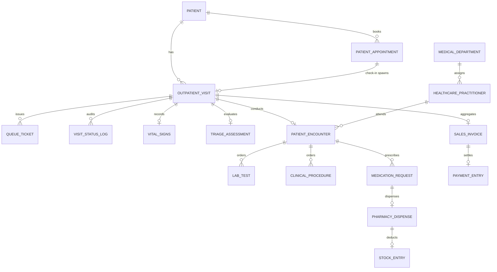

# Data Model & Technical Design — SIMRS Mini (Frappe Healthcare v15)

> **Versi:** 0.2 (Synchronized with Interactive Mockup & Prototype Data Model) · **Tanggal:** 2026-10-08  
> Pelengkap `prd.md`, `system-hierarchy.md`, `user-role.md`, dan koleksi API `docs/api/simrs-update-v2.json`.  
> Menjelaskan DocType (native Healthcare vs custom), JavaScript domain service layer (`js/services.js`), master data catalog (`js/data.js`), state machine alur kunjungan, dan bridging API Frappe/SatuSehat (`js/api-client.js`).
>
> ⚠️ **Prinsip Sinkronisasi:** Seluruh struktur data dan alur status di bawah ini telah diverifikasi dan berjalan interaktif pada mockup web app (`index.html` via `./start.sh`). Implementasi backend Frappe v15 mengadopsi model domain yang sama persis untuk menjamin keselarasan antara desain operasional dan sistem nyata.

---

## 1. Prinsip & Konvensi Arsitektur

| # | Prinsip | Implementasi di Mockup & Backend |
|---|---|---|
| **P-1** | **No Core Modification** | Jangan memodifikasi core `frappe`, `erpnext`, atau `healthcare`. Seluruh ekstensi dilakukan di custom app `simrs_mini`: Custom Field, Property Setter, `doc_events`, whitelist API, dan fixtures. |
| **P-2** | **Native-First & Gap Customization** | Pakai DocType native Healthcare (`Patient`, `Patient Encounter`, `Vital Signs`, `Lab Test`, `Sales Invoice`) bila tersedia. Buat DocType custom hanya untuk celah alur: `Outpatient Visit` (orkestrator alur), `Queue Ticket`, `Triage Assessment`, `Pharmacy Dispense`. |
| **P-3** | **Service Layer Enforcement** | Semua aksi bisnis (registrasi walk-in, panggil antrian, simpan TTV, finalisasi SOAP, dispensing obat, cetak kwitansi) dieksekusi melalui **Domain Service** (`VisitStateService`, `QueueService`, `RegistrationService`, `TriageService`, `DoctorService`, `LabService`, `PharmacyService`, `BillingService`, `AuditService` di `js/services.js`). UI tidak pernah mengubah status database secara langsung. |
| **P-4** | **Single Transition Function** | Status kunjungan dan antrian HANYA berubah lewat fungsi sentral `VisitStateService.transition(visitId, targetState, reason)` dengan tabel validasi `VISIT_ALLOWED_TRANSITIONS`. Transisi di luar tabel otomatis ditolak (`ValidationError`). |
| **P-5** | **Idempotensi & Safe Re-run** | Check-in, penerbitan tiket, dan agregasi tagihan (`BillingService.aggregateInvoice`) bersifat idempoten; aman dipanggil ulang tanpa menduplikasi data atau tagihan. |
| **P-6** | **Audit Trail & No Hard Delete** | Tidak ada hard delete untuk data klinis, rekam medis, dan transaksi finansial. Setiap aksi dicatat ke `AuditService` (disimpan di `SIMRS_AUDIT_LOGS`) mencakup stempel waktu, user, role, dan deskripsi tindakan. |
| **P-7** | **Lokalitas Indonesia** | Zona waktu `Asia/Jakarta`, mata uang Rupiah (`IDR`), bahasa UI Indonesia (`id`), standar penamaan rekam medis `RM-2026-####`, NIK 16 digit terverifikasi, dan kwitansi `KWT-2026-#####`. Kode DocType dan field menggunakan snake_case bahasa Inggris. |
| **P-8** | **Privasi PHI & Display Aman** | Tidak ada nama pasien, diagnosis, atau data klinis sensitif pada layar antrian publik (`display` / TV antrian). Display hanya menampilkan nomor tiket (`A-001`), ruang tujuan, dan status. |
| **P-9** | **One System, Multi-Role (ADR A-00)** | Satu site, satu aplikasi, satu database. Perbedaan hak akses staf (Perekam Medis, Perawat, Dokter, Farmasis, Kasir, Supervisor, Auditor) diatur oleh permission engine (`js/permissions.js` / Frappe RBAC). |
| **P-10** | **Dual-Mode API & Interoperabilitas** | Aplikasi mendukung mode simulasi (LocalStorage offline) dan mode live bridging Frappe REST / SatuSehat FHIR API melalui `FrappeApiClient` (`js/api-client.js`). |

---

## 2. Peta Entitas & Sumber Penyimpanan

Tabel berikut memetakan konsep bisnis, DocType Frappe v15, entitas pada JavaScript mockup, dan kunci LocalStorage:

| Objek Bisnis | DocType Frappe v15 | Tipe | Mockup Entity (`js/`) | LocalStorage Key | Menu Terkait |
|---|---|---|---|---|---|
| Master Departemen / Poli | `Medical Department` | Native | `SIMRS_MASTER_DATA.departments` | In-memory / Code | 1.1, 8.1 |
| Master Dokter Praktisi | `Healthcare Practitioner` | Native | `SIMRS_MASTER_DATA.practitioners` | In-memory / Code | 1.1, 3.1 |
| Master Diagnosa ICD-10 | `Medical Code` (ICD-10) | Native | `SIMRS_MASTER_DATA.icd10` | In-memory / Code | 3.7 |
| Master Obat Formularium | `Item` (Medication) | Native | `SIMRS_MASTER_DATA.medicines` | In-memory / Code | 3.9, 5.1 |
| Master Paket Uji Lab | `Lab Test Template` | Native | `SIMRS_MASTER_DATA.labTests` | In-memory / Code | 3.8, 4.1 |
| Master Tarif & Tindakan | `Item` / `Item Price` | Native | `SIMRS_MASTER_DATA.services` | In-memory / Code | 3.8, 6.3 |
| Data Pasien | `Patient` | Native + CF | `RegistrationService.patients` | `SIMRS_PATIENTS` | 1.2, 1.5 |
| **Alur Kunjungan** | **`Outpatient Visit`** | **Custom** | `VisitStateService.visits` | `SIMRS_VISITS` | 1.4, 7.6 |
| **Nomor Antrian** | **`Queue Ticket`** | **Custom** | `QueueService` + sequence | `SIMRS_TICKETS_SEQ` | 1.7, 8.x |
| Panggilan Display Terakhir | `Queue Board Entry` | Config | `SIMRS_LATEST_CALL` | `SIMRS_LATEST_CALL` | 8.2 |
| Tanda Vital (TTV) | `Vital Signs` | Native | `visit.vitals` | Bagian dari `SIMRS_VISITS` | 2.3 |
| **Skrining Triase** | **`Triage Assessment`** | **Custom** | `visit.triage` | Bagian dari `SIMRS_VISITS` | 2.4, 2.5 |
| Encounter & Rekam Medis (SOAP) | `Patient Encounter` | Native + CF | `visit.encounter` | Bagian dari `SIMRS_VISITS` | 3.4–3.12 |
| Order & Hasil Laboratorium | `Lab Test` | Native | `visit.encounter.labOrders` | Bagian dari `SIMRS_VISITS` | 4.1–4.5 |
| Resep & Dispensing Farmasi | `Pharmacy Dispense` | **Custom** | `visit.encounter.prescriptions` | Bagian dari `SIMRS_VISITS` | 5.1–5.5 |
| Tagihan & Kwitansi Kasir | `Sales Invoice` | Native + CF | `visit.receipt` | Bagian dari `SIMRS_VISITS` | 6.1–6.5 |
| **Jejak Audit Sistem** | **`Audit Trail Log`** | **Custom** | `AuditService.logs` | `SIMRS_AUDIT_LOGS` | Audit Trail |
| Bridging SatuSehat FHIR | `SatuSehat Log` | Custom | `FrappeApiClient` | Simulated / REST | API Tester |

---

## 3. Spesifikasi Detail Entitas Data

### 3.1 `Outpatient Visit` — Orkestrator Kunjungan Rawat Jalan

Dokumen orkestrasi sentral yang dibuat saat pasien check-in / registrasi walk-in. Seluruh aktivitas medis dan administratif menautkan ID dokumen ini.

| Field | Tipe Data | Keterangan & Validasi |
|---|---|---|
| `id` / `name` | String / Series | Walk-in: Format `REG-WALK-[random char]` (misal: `REG-WALK-B8K21`, 5 karakter acak alphanumeric huruf kapital/angka untuk mencegah duplikasi dan ID yang terus memanjang). Appointment/Core: Format `OPV-2026-####` (Auto-increment 4 digit per tahun). |
| `registeredAt` | ISO Datetime | Timestamp waktu pendaftaran registrasi dibuat (disimpan backend & ditampilkan pada tabel registrasi walk-in). |
| `patientId` | Link `Patient` | ID Pasien (misal: `PAT-001`, `PAT-WALK`) |
| `patientName` | String | Nama lengkap pasien (diambil dari master pasien) |
| `mrNo` | String | Nomor Rekam Medis unik: `RM-2026-####` |
| `departmentId` | Link `Medical Department` | Kode Poli tujuan: `POLI-INT`, `POLI-ANAK`, `POLI-GIGI`, `POLI-BEDAH`, `POLI-SARAF`, `POLI-MATA` |
| `departmentName` | String | Nama resmi poliklinik (misal: *Poli Penyakit Dalam*) |
| `practitionerId` | Link `Practitioner` | ID Dokter: `DOC-HENDRA`, `DOC-ANISA`, `DOC-BAMBANG`, `DOC-MAYA`, `DOC-CYNTHIA` |
| `practitionerName` | String | Nama lengkap dokter dengan gelar spesialis |
| `registrationSource` | Select | Pilihan: `Walk-in`, `Kiosk`, `Online Appointment` |
| `payerType` | Select | Pilihan: `Umum`, `BPJS`, `Asuransi`, `Perusahaan` |
| `paymentSubMethod` | Select | Sub-metode pembayaran: `Cash`, `QRIS`, `Debit/Credit Card`, `Transfer`, `VA` |
| `payerMemberNo` | String | Nomor kepesertaan kartu BPJS / Asuransi (13-16 digit) |
| `companyName` | String | Nama institusi/perusahaan penjamin (jika payerType = Perusahaan) |
| `guarantorCode` | String | Kode verifikasi/klaim penjamin |
| `guarantorLetterNo` | String | Nomor Surat Jaminan / SEP BPJS |
| `paymentDetails` | Object / JSON | Rincian data penjamin (nama perusahaan, PIC, masa berlaku) |
| `paymentDetailSummary` | String | Ringkasan teks verifikasi penjamin |
| `eligibilityStatus` | Select | Status eligibilitas: `Tidak Perlu`, `Valid`, `Valid Asuransi`, `Dijamin Perusahaan` |
| `visitStatus` | Select (Controlled) | Status alur kunjungan (lihat §6.1): `REGISTERED`, `WAITING_TRIAGE`, `IN_TRIAGE`, `WAITING_DOCTOR`, `IN_SERVICE`, `WAITING_RESULTS`, `SERVICE_COMPLETED`, `ESCALATED`, `CLOSED`, `CANCELLED` |
| `pharmacyStatus` | Select | Status layanan farmasi: `Not Required`, `Pending`, `Preparing`, `Ready`, `Dispensed` |
| `billingStatus` | Select | Status administrasi kasir: `Pending`, `Invoiced`, `Paid`, `Guaranteed` |
| `ticketNo` | String | Nomor tiket antrian aktif (misal: `A-001`, `T-004`) |
| `queueType` | Select | Tipe antrian aktif: `Triase`, `Dokter`, `Kasir`, `Farmasi` |
| `hasPrescription` | Boolean | True jika dokter meresepkan obat formularium |
| `pendingOrders` | Integer | Jumlah order laboratorium penunjang yang berstatus `Pending` |
| `vitals` | Sub-document | Rekam tanda vital pasien (lihat §3.3) |
| `triage` | Sub-document | Rekam asesmen dan skrining triase perawat (lihat §3.3) |
| `encounter` | Sub-document | Rekam medis konsultasi dokter & SOAP (lihat §3.4) |
| `receipt` | Sub-document | Rekam kwitansi pembayaran kasir (lihat §3.7) |
| `pharmacyTicket` | String | Nomor antrian farmasi (awalan `F-###`) |
| `cashierTicket` | String | Nomor antrian kasir (awalan `K-###`) |
| `checkedInAt` | ISO Datetime | Waktu check-in / cetak tiket di loket |
| `triageStartedAt` | ISO Datetime | Waktu pemanggilan ke bilik triase |
| `triageCompletedAt` | ISO Datetime | Waktu selesai skrining TTV & diarahkan ke poli |
| `serviceStartedAt` | ISO Datetime | Waktu pemanggilan masuk ruang dokter |
| `serviceCompletedAt` | ISO Datetime | Waktu dokter memfinalisasi rekam medis SOAP |
| `dispensedAt` | ISO Datetime | Waktu penyerahan obat oleh apoteker |
| `closedAt` | ISO Datetime | Waktu kunjungan resmi ditutup di sistem |
| `statusLog` | Array of Objects | Jejak riwayat transisi: `[{fromState, toState, changedAt, changedBy, reason}]` |

---

### 3.2 `Queue Ticket` & Prefiks Antrian

Pengelolaan antrian terpusat berbasis urutan harian (`SIMRS_TICKETS_SEQ`):

| Prefiks | Unit / Poliklinik Tujuan | Format Nomor | Destination Display |
|:---:|---|:---:|---|
| **A** | Poli Penyakit Dalam | `A-001` s/d `A-999` | Ruang 101, Lantai 1 |
| **B** | Poli Anak | `B-001` s/d `B-999` | Ruang 102, Lantai 1 |
| **C** | Poli Gigi & Mulut | `C-001` s/d `C-999` | Ruang 103, Lantai 1 |
| **D** | Poli Bedah Umum | `D-001` s/d `D-999` | Ruang 104, Lantai 1 |
| **E** | Poli Saraf | `E-001` s/d `E-999` | Ruang 105, Lantai 1 |
| **F** | Poli Mata / Pelayanan Farmasi | `F-001` s/d `F-999` | Loket Farmasi Rawat Jalan |
| **K** | Kasir & Pembayaran | `K-001` s/d `K-999` | Loket Kasir Utama |
| **T** | Bilik Skrining Triase | `T-001` s/d `T-999` | Bilik Triase & TTV |

**Mekanisme Audio Call Synthesizer (`QueueService.announceTicket`):**
1. **Audio Chime Generator:** Menggunakan Web Audio API (`AudioContext`) tanpa dependensi file eksternal audio; membunyikan dua nada harmonik: frekuensi 587.33 Hz (D5) beralih ke 880.00 Hz (A5) dengan durasi 0.5 detik.
2. **Text-to-Speech:** Memanggil Web Speech API (`SpeechSynthesisUtterance`) bahasa Indonesia (`lang: "id-ID"`, `rate: 0.9`):  
   *"Nomor antrian, [Prefix] [Nomor], silakan menuju, [Nama Ruang / Poli]"*.
3. **Display Broadcast:** Menyimpan data panggilan ke `SIMRS_LATEST_CALL` untuk disinkronkan secara realtime ke layar TV display antrian publik.

> **Catatan Alur Pemanggilan Antrian:** Antrian loket pendaftaran rawat jalan ditiadakan (petugas pendaftaran bukan petugas antrian). Pasien walk-in langsung didata di meja pendaftaran dan diterbitkan ID kunjungan serta tiket triase (T-xxx). Pemanggilan antrian dan audio bell synthesizer resmi dimulai pada stasiun **Bilik Skrining Triase (TTV)** oleh Perawat dan **Ruang Poliklinik** oleh Dokter DPJP, serta dilanjutkan ke Kasir dan Farmasi.

---

### 3.3 `Vital Signs` & `Triage Assessment`

Tersimpan pada properti `visit.vitals` dan `visit.triage`:

```json
{
  "vitals": {
    "systolic": 120,
    "diastolic": 80,
    "pulse": 82,
    "temperature": 36.8,
    "respiratoryRate": 18,
    "spo2": 98,
    "height": 168.0,
    "weight": 64.0,
    "bmi": 22.7,
    "bmiStatus": "Normal"
  },
  "triage": {
    "chiefComplaint": "Pusing berputar sejak 2 hari yang lalu dan tenggorokan kering",
    "fallRisk": "Rendah",
    "allergies": "Tidak ada riwayat alergi",
    "painScore": 2,
    "infectionScreening": "Tidak ada",
    "outcome": "Normal",
    "escalatedTo": "",
    "notes": "Keadaan umum baik, compos mentis, akral hangat."
  }
}
```

**Kalkulasi & Validasi Klinis:**
- **Indeks Massa Tubuh (BMI):** Dihitung otomatis dengan rumus:
  $$\text{BMI} = \frac{\text{Berat Badan (kg)}}{(\text{Tinggi Badan (m)})^2}$$
  Kategori klasifikasi Asia-Pasifik:
  - `< 18.5`: *Kurus (Underweight)*
  - `18.5 – 22.9`: *Normal*
  - `23.0 – 24.9`: *Kelebihan BB (Overweight)*
  - `≥ 25.0`: *Obesitas*
- **Skala Nyeri (VAS 0–10):** Visual Analog Scale dengan indikator warna visual: 0 (Bebas Nyeri / Hijau), 1–3 (Nyeri Ringan / Kuning), 4–6 (Nyeri Sedang / Oranye), 7–10 (Nyeri Berat / Merah).
- **Logika Routing Triase:**
  - `Normal` / `Perlu Perhatian`: Transisi status kunjungan ke `WAITING_DOCTOR`, tiket antrian dokter diaktifkan.
  - `Perlu Eskalasi`: Transisi status ke `ESCALATED`, mencatat rujukan darurat ke `escalatedTo` (misal: "IGD PONEK" atau "Instalasi Gawat Darurat").

---

### 3.4 `Patient Encounter` & Rekam Medis SOAP

Tersimpan pada properti `visit.encounter` saat dokter memeriksa pasien:

```json
{
  "encounter": {
    "subjective": "Pasien mengeluhkan leher terasa kaku dan sering pusing sejak 3 hari yang lalu. Riwayat konsumsi makanan tinggi garam.",
    "objective": "TD: 145/95 mmHg, N: 84x/m, S: 36.5 C. Jantung S1-S2 reguler, bising jantung (-), paru vesikuler bilateral.",
    "primaryDiagnosis": {
      "code": "I10",
      "name": "Essential (primary) hypertension",
      "category": "Kardiovaskular"
    },
    "secondaryDiagnoses": [
      {
        "code": "E78.5",
        "name": "Hyperlipidemia, unspecified",
        "category": "Metabolik"
      }
    ],
    "plan": "Edukasi pembatasan konsumsi garam harian, olahraga teratur 30 menit per hari, evaluasi profil lipid rutin.",
    "procedures": [
      { "id": "SRV-CONS-SP", "name": "Konsultasi Dokter Spesialis", "price": 150000, "category": "Jasa Medis" },
      { "id": "SRV-EKG", "name": "Pemeriksaan EKG 12-Lead", "price": 75000, "category": "Tindakan" }
    ],
    "prescriptions": [
      {
        "medicineId": "MED-001",
        "medicineName": "Amlodipine 5 mg",
        "dosage": "1 x 1 tablet malam",
        "qty": 30,
        "unitPrice": 850,
        "totalPrice": 25500,
        "instructions": "Diminum malam hari sesudah makan"
      }
    ],
    "labOrders": [
      {
        "testId": "LAB-LIPID",
        "testName": "Profil Lipid (Lemak Darah)",
        "price": 180000,
        "status": "Completed",
        "summary": "Kolesterol Total: 215 mg/dL (Tinggi), Trigliserida: 160 mg/dL",
        "completedBy": "Petugas Lab",
        "completedAt": "2026-10-08T10:15:00.000Z"
      }
    ],
    "followUpDays": 14,
    "isFinalized": true,
    "finalizedAt": "2026-10-08T10:30:00.000Z",
    "finalizedBy": "dr. Hendra Pratama, Sp.PD"
  }
}
```

**Aturan Finalisasi (Checklist Kualitas):**
Dokter tidak dapat melakukan submit/finalisasi jika:
1. Anamnesis (`subjective`) kosong atau kurang dari 5 karakter.
2. Kode Diagnosis Utama (`primaryDiagnosis.code`) belum dipilih dari katalog ICD-10.
3. Rencana Terapi / Instruksi (`plan`) kosong atau kurang dari 5 karakter.
4. Saat difinalisasi, sistem otomatis memicu penerbitan tiket Farmasi (`F-###`) jika ada obat diresepkan, dan tiket Kasir (`K-###`).

---

### 3.5 `Pharmacy Dispense` & Validasi Apoteker

Memproses resep obat dari rekam medis dokter (`PharmacyService.dispenseMedications`):
1. **Verifikasi 7 Benar:** Tepat Pasien, Tepat Obat, Tepat Dosis, Tepat Waktu, Tepat Rute, Tepat Dokumentasi, Tepat Informasi.
2. **Pengurangan Stok:** Memotong stok fisik pada master obat (`SIMRS_MASTER_DATA.medicines`).
3. **Catatan Telaah Resep:** Menyimpan telaah telaah apoteker (default: *"7 Benar obat terverifikasi valid"*).
4. **Penyelesaian Otomatis:** Mengubah `pharmacyStatus` menjadi `Dispensed`. Apabila pembayaran kasir sudah lunas (`billingStatus === "Paid"`), kunjungan secara otomatis ditutup ke `CLOSED`.

---

### 3.6 Order Laboratorium & Panel Patologi

Tersimpan pada `visit.encounter.labOrders`:
- Mendukung 6 jenis pemeriksaan klinik utama (Darah Lengkap CBC, Profil Lipid, GDS, GDP, Asam Urat, Fungsi Ginjal).
- Saat order dibuat: status `Pending`, `visit.pendingOrders` bertambah, dokter dapat menahan alur kunjungan ke `WAITING_RESULTS`.
- Saat hasil dirilis oleh Petugas Lab (`LabService.submitLabResult`): status berubah menjadi `Completed`, hasil uji terisi lengkap dengan evaluasi normal/abnormal, dan `visit.pendingOrders` berkurang.

---

### 3.7 `Sales Invoice` & Kwitansi Kasir

Dihasilkan oleh `BillingService.aggregateInvoice(visitId)` dan dieksekusi oleh `BillingService.processPayment`:

```json
{
  "receipt": {
    "receiptNo": "KWT-2026-84721",
    "paymentMethod": "QRIS",
    "paidAmount": 275500,
    "changeAmount": 0,
    "paidAt": "2026-10-08T10:45:00.000Z",
    "cashier": "Kasir Rawat Jalan",
    "invoice": {
      "subtotal": 450500,
      "coveredAmount": 175000,
      "patientPayAmount": 275500,
      "items": [
        { "name": "Biaya Registrasi & Administrasi Rawat Jalan", "qty": 1, "unitPrice": 20000, "total": 20000, "category": "Administrasi" },
        { "name": "Asuhan Keperawatan & Skrining Triase", "qty": 1, "unitPrice": 25000, "total": 25000, "category": "Keperawatan" },
        { "name": "Konsultasi Dokter Spesialis", "qty": 1, "unitPrice": 150000, "total": 150000, "category": "Jasa Medis" },
        { "name": "Pemeriksaan EKG 12-Lead", "qty": 1, "unitPrice": 75000, "total": 75000, "category": "Jasa Medis" },
        { "name": "Obat: Amlodipine 5 mg (1 x 1 tablet malam)", "qty": 30, "unitPrice": 850, "total": 25500, "category": "Farmasi" },
        { "name": "Pemeriksaan Lab: Profil Lipid (Lemak Darah)", "qty": 1, "unitPrice": 180000, "total": 180000, "category": "Penunjang" }
      ]
    }
  }
}
```

**Skema Penjaminan Biaya:**
- **BPJS Kesehatan:** `coveredAmount = 100%`, `patientPayAmount = Rp 0` (Klaim jaminan penuh).
- **Asuransi Swasta:** `coveredAmount = 85%`, `patientPayAmount = 15%` (Skema Co-payment).
- **Umum / Mandiri:** `coveredAmount = 0%`, `patientPayAmount = 100%` (Ditagih langsung kepada pasien).

---

## 4. Master Data Catalog (`js/data.js`)

Mockup dan backend Frappe menggunakan master data standar yang seragam:

### 4.1 Master Poliklinik (Departments)
1. `POLI-INT`: Poli Penyakit Dalam (Prefix: `A`, Ruang 101, Lantai 1)
2. `POLI-ANAK`: Poli Anak (Prefix: `B`, Ruang 102, Lantai 1)
3. `POLI-GIGI`: Poli Gigi & Mulut (Prefix: `C`, Ruang 103, Lantai 1)
4. `POLI-BEDAH`: Poli Bedah Umum (Prefix: `D`, Ruang 104, Lantai 1)
5. `POLI-SARAF`: Poli Saraf (Prefix: `E`, Ruang 105, Lantai 1)
6. `POLI-MATA`: Poli Mata (Prefix: `F`, Ruang 106, Lantai 1)

### 4.2 Master Praktisi Medis (Practitioners)
1. `DOC-HENDRA`: dr. Hendra Pratama, Sp.PD (`POLI-INT`, SIP: `503/SIP/DINKES/2022`)
2. `DOC-ANISA`: dr. Anisa Putri, Sp.A (`POLI-ANAK`, SIP: `503/SIP/DINKES/2021`)
3. `DOC-BAMBANG`: dr. Bambang Irawan, Sp.B (`POLI-BEDAH`, SIP: `503/SIP/DINKES/2020`)
4. `DOC-MAYA`: drg. Maya Safitri (`POLI-GIGI`, SIP: `503/SIP/DINKES/2023`)
5. `DOC-CYNTHIA`: dr. Cynthia Dewi, Sp.S (`POLI-SARAF`, SIP: `503/SIP/DINKES/2022`)

### 4.3 Master Diagnosa ICD-10 Terpilih
- `I10`: Essential (primary) hypertension
- `E11.9`: Type 2 diabetes mellitus without complications
- `J06.9`: Acute upper respiratory infection, unspecified (ISPA)
- `K29.7`: Gastritis, unspecified
- `E78.5`: Hyperlipidemia, unspecified
- `M54.5`: Low back pain
- `J45.909`: Unspecified asthma, uncomplicated
- `A09`: Infectious gastroenteritis and colitis, unspecified (Diare Akut)
- `K30`: Functional dyspepsia
- `N39.0`: Urinary tract infection, site not specified (ISK)
- `K02.9`: Dental caries, unspecified
- `K04.0`: Pulpitis
- `H10.9`: Conjunctivitis, unspecified
- `R50.9`: Fever, unspecified (Demam Akut)

### 4.4 Master Obat Formularium (Medicines)
- `MED-001`: Amlodipine 5 mg (Tablet, Rp 850)
- `MED-002`: Amlodipine 10 mg (Tablet, Rp 1.200)
- `MED-003`: Candesartan 8 mg (Tablet, Rp 2.800)
- `MED-004`: Metformin 500 mg (Tablet, Rp 700)
- `MED-005`: Glimepiride 2 mg (Tablet, Rp 1.500)
- `MED-006`: Paracetamol 500 mg (Tablet, Rp 500)
- `MED-007`: Amoxicillin 500 mg (Kapsul, Rp 1.100)
- `MED-008`: Cefixime 100 mg (Kapsul, Rp 4.500)
- `MED-009`: Omeprazole 20 mg (Kapsul, Rp 1.800)
- `MED-010`: Antasida DOEN (Tablet Kunyah, Rp 400)
- `MED-011`: Simvastatin 10 mg (Tablet, Rp 1.300)
- `MED-012`: Cetirizine 10 mg (Tablet, Rp 900)
- `MED-013`: Asam Mefenamat 500 mg (Kaplet, Rp 1.000)
- `MED-014`: Salbutamol Inhaler 100 mcg (Inhaler, Rp 65.000)

### 4.5 Master Paket Uji Lab Patologi
- `LAB-CBC`: Darah Lengkap / Rutin CBC (Rp 95.000; Hb, Leukosit, Trombosit, Hematokrit)
- `LAB-LIPID`: Profil Lipid (Rp 180.000; Kolesterol Total, Trigliserida, HDL, LDL)
- `LAB-GDS`: Gula Darah Sewaktu (Rp 45.000)
- `LAB-GDP`: Gula Darah Puasa (Rp 50.000)
- `LAB-URIC`: Asam Urat Darah (Rp 50.000)
- `LAB-RENAL`: Fungsi Ginjal (Rp 110.000; Ureum, Kreatinin)

### 4.6 Master Tarif Pelayanan & Tindakan
- `SRV-REG`: Administrasi & Pendaftaran Pasien (Rp 20.000)
- `SRV-NURS`: Asuhan Keperawatan & Triase (Rp 25.000)
- `SRV-CONS-SP`: Konsultasi Dokter Spesialis (Rp 150.000)
- `SRV-CONS-GP`: Konsultasi Dokter Umum / Gigi (Rp 80.000)
- `SRV-EKG`: Pemeriksaan EKG 12-Lead (Rp 75.000)
- `SRV-NEBU`: Terapi Nebulisasi (Rp 65.000)
- `SRV-WOUND`: Perawatan Luka Ringan / Ganti Verban (Rp 55.000)
- `SRV-SCALING`: Pembersihan Karang Gigi / Scaling (Rp 200.000)

---

## 5. ER Diagram (Entity-Relationship)



---

## 6. State Machine & Lifecycle Kunjungan

### 6.1 State Machine Terpadu (`VISIT_ALLOWED_TRANSITIONS`)

Diagram berikut menggambarkan siklus hidup aktual kunjungan dari pendaftaran hingga penutupan:

```text
  [REGISTERED]
       │
       ▼
[WAITING_TRIAGE] ───────────┐
       │                    │
       ▼                    │
  [IN_TRIAGE] ────► [ESCALATED] (Darurat IGD)
       │                    │
       ▼                    │
[WAITING_DOCTOR]            │
       │                    │
       ▼                    │
  [IN_SERVICE] ◄────┐       │
       │     ▲      │       │
       ▼     │      │       │
[WAITING_RESULTS]   │       │
       │            │       │
       ▼            │       │
[SERVICE_COMPLETED] │       │
       │                    │
       ▼                    ▼
   [CLOSED] ◄───────────────┘

*Catatan: Semua status pra-layanan dapat beralih ke [CANCELLED] jika pasien batal berobat.
```

### 6.2 Matriks Transisi Status Kunjungan

| Dari Status | Ke Status | Pemicu (Service) | Aktor | Guard / Syarat Validasi | Efek Samping Sistem |
|---|---|---|---|---|---|
| `REGISTERED` | `WAITING_TRIAGE` | `RegistrationService.registerWalkIn` | Perekam Medis / Kiosk | Data identitas pasien & poli lengkap | Terbit nomor tiket triase (`T-###`), masuk antrian triase |
| `WAITING_TRIAGE` | `IN_TRIAGE` | `QueueService.call` | Perawat Triase | Tiket triase berstatus `WAITING` | Tiket menjadi `CALLED`, audio chime berbunyi, catat `triageStartedAt` |
| `IN_TRIAGE` | `WAITING_DOCTOR` | `TriageService.saveTriageAndVitals` | Perawat Triase | TTV terisi, skrining lengkap, `outcome ≠ "Perlu Eskalasi"` | Tiket triase `COMPLETED`, terbit nomor tiket poli (`A`-`F`), catat `triageCompletedAt` |
| `IN_TRIAGE` | `ESCALATED` | `TriageService.saveTriageAndVitals` | Perawat Triase | `outcome === "Perlu Eskalasi"` | Catat unit rujukan darurat (`escalatedTo`), alur poliklinik selesai |
| `WAITING_DOCTOR` | `IN_SERVICE` | `DoctorService.startService` | Dokter Spesialis | Tiket dokter dipanggil | Tiket menjadi `IN_SERVICE`, catat `serviceStartedAt` |
| `IN_SERVICE` | `WAITING_RESULTS` | `DoctorService.saveEncounter` (Draft) | Dokter Spesialis | Ada order lab berstatus `Pending` | Dokter dapat melayani pasien lain sambil menunggu hasil |
| `WAITING_RESULTS` | `IN_SERVICE` | `DoctorService.startService` | Dokter Spesialis | Hasil uji lab telah diisi oleh analis | Konsultasi dokter dilanjutkan dengan telaah hasil penunjang |
| `IN_SERVICE` / `WAITING_RESULTS` | `SERVICE_COMPLETED` | `DoctorService.saveEncounter` (Finalize) | Dokter Spesialis | Checklist kelengkapan SOAP & diagnosis ICD-10 terpenuhi | Kunci rekam medis, catat `serviceCompletedAt`, terbit tiket Kasir (`K-###`) dan Farmasi (`F-###` jika ada resep) |
| `SERVICE_COMPLETED` | `CLOSED` | `PharmacyService.dispense` / `BillingService.processPayment` | Apoteker / Kasir | Tagihan lunas (`Paid` / `Guaranteed`) **dan** obat terdispensing (`Dispensed` / `Not Required`) | Kunjungan resmi ditutup, catat `closedAt`, kunci transaksi finansial |
| `ESCALATED` | `CLOSED` | `VisitStateService.transition` | Supervisor / Perawat | Pasien berhasil dipindahkan ke IGD / fasilitas rujukan | Kunjungan rawat jalan ditutup |
| *Status apapun sebelum finalisasi* | `CANCELLED` | `VisitStateService.transition` | Perekam Medis / Supervisor | Alasan pembatalan (`reason`) wajib dicantumkan | Batalkan semua tiket antrian aktif, catat ke log audit |

---

## 7. Service Layer, Hook, & Dual-Mode API

### 7.1 Daftar Domain Service (`js/services.js`)

1. **`VisitStateService`**: Mengelola state machine sentral `VISIT_ALLOWED_TRANSITIONS`, pencatatan milestone waktu tunggu (`checkedInAt`, `triageStartedAt`, `triageCompletedAt`, `serviceStartedAt`, `serviceCompletedAt`, `closedAt`), dan append audit log.
2. **`QueueService`**: Pengelolaan sequence tiket per prefiks, pembunyian Web Audio oscillator chime (D5 -> A5), pembacaan Web Speech API (suara Indonesia), dan broadcast display.
3. **`RegistrationService`**: Pencarian pasien multi-kriteria, pencegahan duplikasi NIK 16 digit, pendaftaran pasien baru, dan pembuatan kunjungan walk-in/kiosk dengan verifikasi penjamin.
4. **`TriageService`**: Kalkulasi otomatis BMI & status gizi, pencatatan skor nyeri VAS 0-10, evaluasi skrining risiko jatuh/infeksi, dan routing pasien ke poli atau eskalasi darurat.
5. **`DoctorService`**: Pengelolaan antrian spesifik dokter login, penyimpanan draft SOAP, checklist validasi finalisasi medis, integrasi tindakan, resep, dan permintaan uji laboratorium.
6. **`LabService`**: Pengambilan daftar order lab aktif (`getPendingOrders`), pengisian parameter hasil uji, evaluasi rentang rujukan normal, dan rilis hasil uji ke rekam medis.
7. **`PharmacyService`**: Antrian penyiapan resep obat, verifikasi 7 benar telaah obat, pemotongan stok formularium, dan penyerahan obat kepada pasien.
8. **`BillingService`**: Agregasi otomatis seluruh biaya layanan (administrasi, keperawatan, jasa dokter, tindakan, obat, lab), kalkulasi porsi penjamin vs porsi pasien, pemrosesan pembayaran kasir, dan penerbitan kwitansi pembayaran resmi.
9. **`AuditService`**: Pencatatan histori aktivitas pengguna (`timestamp`, `date`, `user`, `role`, `action`) hingga 200 rekam jejak terakhir untuk kepatuhan audit medis.

### 7.2 Bridging Frappe REST & SatuSehat FHIR API (`js/api-client.js`)

Client API bawaan mendukung 2 mode operasional:
- **Mode Simulated:** Menjalankan transaksi mock di LocalStorage untuk kebutuhan demonstrasi, pelatihan, dan testing antarmuka tanpa dependensi backend.
- **Mode Live:** Melakukan HTTP request nyata ke backend Frappe Framework / ERPNext Healthcare (Base URL default: `http://clinic.satusehat:8000`).

**Endpoint yang Terhubung dengan Koleksi Postman (`docs/api/simrs-update-v2.json`):**
1. `GET /api/method/frappe.auth.get_logged_user`: Verifikasi koneksi dan sesi login aktif.
2. `POST /api/method/login`: Autentikasi credential pengguna.
3. `POST /api/resource/Vital Signs`: Pengiriman data TTV pasien ke DocType native Healthcare.
4. `GET /api/method/clinic_satusehat.api.satusehat.encounter?encounter_id={id}`: Pengiriman payload FHIR Encounter ke platform SatuSehat Kemenkes RI (`resourceType: Encounter`, `status: finished`, `class: AMB`).

---

## 8. Realtime Display Antrian & Integrasi TV

- **Layar TV Display Publik (`/display`):**
  - Hanya menampilkan nomor tiket, nama poli / loket tujuan, ruang, dan status pemanggilan.
  - Sesuai prinsip P-8, **tidak ada nama pasien, diagnosis, atau data keuangan** yang ditampilkan ke publik.
  - Memiliki fitur *audio toggle* untuk membunyikan bell synthesizer dan suara robot pemanggil ketika dokter atau petugas loket menekan tombol panggil.
  - Menampilkan ringkasan antrian yang sedang berjalan di 6 poliklinik, kasir, dan farmasi secara live.

---

## 9. Verifikasi Konsistensi Desain (Discovery Checklist)

Bagi implementasi backend Frappe v15 mendatang, gunakan checklist teknis berikut:
- [x] State machine `VISIT_ALLOWED_TRANSITIONS` telah teruji bebas deadlock di frontend mockup.
- [x] Struktur rekam medis SOAP memenuhi 11 elemen data resume medis Permenkes No. 24/2022.
- [x] Skema penjamin BPJS (100% cover), Asuransi (85% cover / 15% co-pay), dan Mandiri terbukti akurat pada kalkulasi kasir.
- [x] Koleksi Postman `docs/api/simrs-update-v2.json` telah selaras dengan parameter bridging pada `js/api-client.js`.
